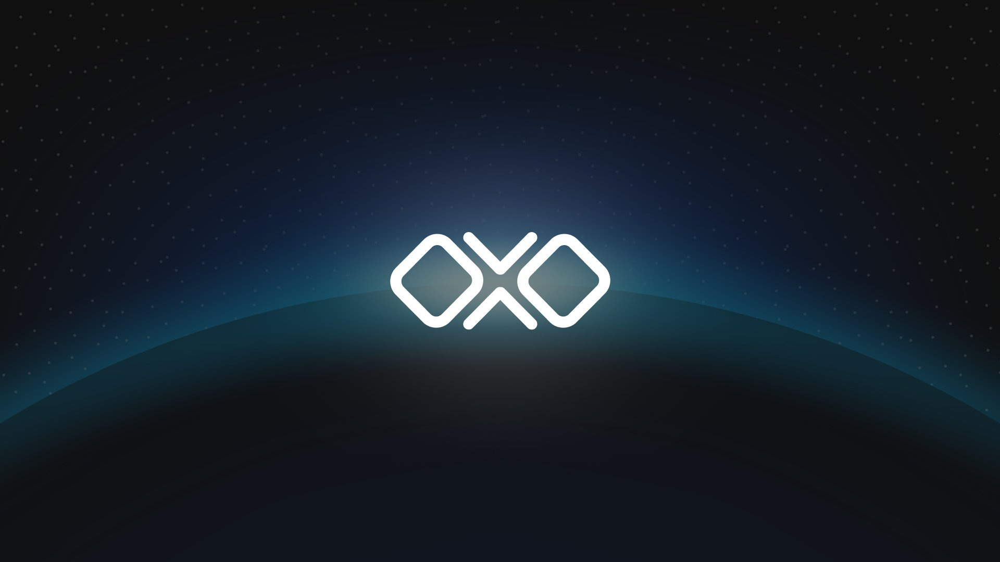

# The OLLO Network



[](https://www.repostatus.org/#active)
[](https://pkg.go.dev/github.com/OllO-Station/ollo/v11)
[](https://goreportcard.com/report/github.com/OllO-Station/ollo/v11)
[](https://github.com/OllO-Station/ollo/releases/latest)
[](https://github.com/OLLO-Station/ollo)
[](https://github.com/OLLO-Station/ollo)
[](https://github.com/OLLO-Station/ollo)
[](https://github.com/OLLO-Station/ollo)
[](https://github.com/OLLO-Station/ollo)
[](https://discord.gg/euGcGgdq7M)
[](https://twitter.com/ollostation)

[](https://github.com/ollo-station/ollo/actions/workflows/build.yml)
---

## Introduction

**OLLO Station** is a sovereign L1 chain built on [Tendermint](https://tendermint.com) and the [Cosmos SDK](https://github.com/cosmos/cosmos-sdk), providing next-gen trading tools & sustainable [tokenomics](https://docs.ollo.zone/about/tokenomics). Our all-in-one design decentralized exchange platform will provide a suite of advanced, automated tools that expand on the basic capabilities of order book trading, staking, bonding, & portfolio control. We're working to provide users with full, automated control over their assets, positions, stakes, bonds & rewards on all connected cosmos chains. We are professional traders, developers, DeFi scientists and dedicated individuals focused on continuous & sustainable DeFi innovation. Our philosophy is built on the idea that the best tools of today are just a glimpse into the possibilities of tomorrow.

We're currently in the testnet phase of our development. Join our [Discord](https://discord.gg/pVCk6BDS) or follow our [Twitter](https://twitter.com/OLLOStation) account for updates.

---

## Getting Started

### Prerequisites

#### Joining testnet

- **For a full walkthrough** on creating an address, joining the network, and getting tokens from the testnet faucet, visit our [documentation](https://docs.ollo.zone).

#### Creating a full node or Validator

- Ensure you have Make and Go (version 1.18) installed
- Ensure you have adequate storage (256GB+) and memory (8GB+ RAM) to run a validator/full node
- For a full, detailed walkthrough on setting up a node and/or validator, visit our official [documentation](https://docs.ollo.zone).

### Installation

First, clone this repository:
```bash
git clone https://github.com/OllO-Station/ollo.git
```

To build the node, run the command:

```bash
make build
```

To install the node on your local machine, run the command:

```bash
make install
```

---

## Resources

**For more information** on setting up a node and/or a validator for the OLLO testnet, please visit the [OLLO docs on setting up a validator](https://docs.ollo.zone/validators/running_a_node)

**To monitor the current testnet status** come and visit the [Wise Explorer](https://explorer.ollo.zone).

**For everything else** as well as a more extensive overview of the project visit OLLO Station's [official website](https://ollo.zone)

---


<!-- ### Contributors -->
<!--  -->

## Extra Links

- [Testnet Repository](https://github.com/OLLO-Station/networks)
- [OLLO Station Home](https://ollostation.zone)
- [OLLO Testnet](https://testnet.ollo.zone)
- [OLLO Documentation](https://docs.ollo.zone)
- [Station8 Validators](https://station8.zone)
- [Repository Wiki](https://github.com/OLLO-Station/ollo/wiki)
- [Repository Discussions](https://github.com/OLLO-Station/ollo/discussions)


