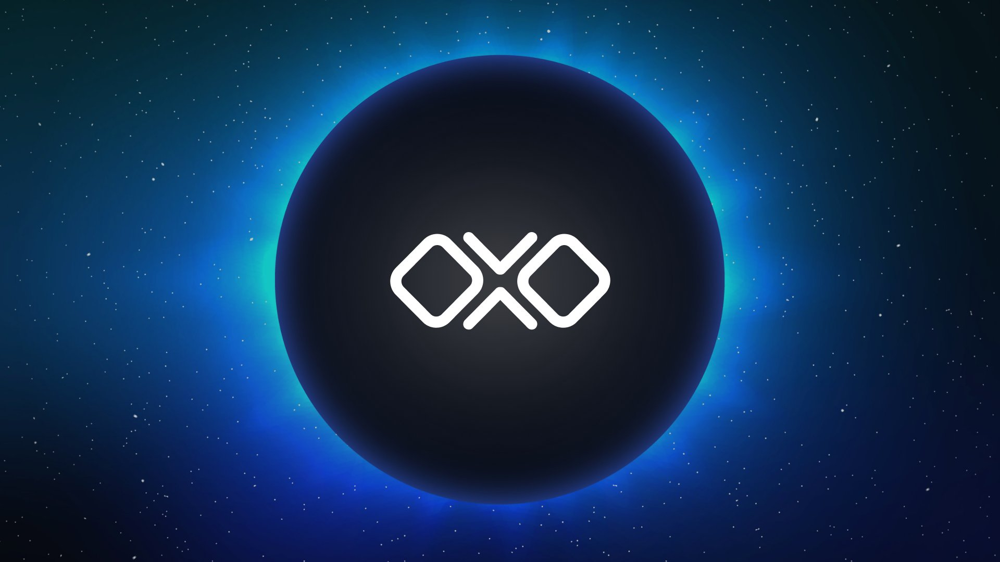

<!--
parent:
  order: false
-->

<h1 align="center">The OLLO Station</h1>

<p align="center">

</p>

<h3 align="center">Welcome aboard the <a href="https://ollostation.zone">OLLO Station</a>, cosmonaut.</h3>

<p align="center">
Learn more about <a href="https://ollostation.zone">the project</a>, explore <a href="https://explorer.ollo.zone">the testnet</a>, or visit <a href="https://docs.ollo.zone">the docs</a>.
</p>

<br/>

<div align="center">

[](https://www.repostatus.org/#active)
[](https://github.com/OLLO-Station/ollo)
[](https://github.com/OllO-Station/ollo/releases/latest)
[](https://github.com/OLLO-Station/ollo)

[](https://github.com/moovweb/gvm)
[](https://pkg.go.dev/github.com/OllO-Station/ollo/v11)
[](https://goreportcard.com/report/github.com/OllO-Station/ollo/v11)

[](https://github.com/OLLO-Station/ollo/stargazers)
[](https://github.com/OLLO-Station/ollo)
[](https://github.com/OLLO-Station/ollo/watchers)
[](https://github.com/ollo-station/ollo)

[](https://github.com/ollo-station/ollo/actions/workflows/build.yml)
[](https://discord.gg/euGcGgdq7M)
[](https://twitter.com/intent/follow?screen_name=OLLOStation)

</div>
<br/>
<div align="center">

</div>

## Welcome Aboard 🤝

**OLLO Station** is a trading platform, network, and sovereign L1 chain built on [Tendermint](https://tendermint.com) and the [Cosmos SDK](https://github.com/cosmos/cosmos-sdk), providing next-gen trading tools and sustainable [tokenomics](https://docs.ollo.zone/about/tokenomics). Our all-in-one decentralized exchange platform will provide a diverse suite of advanced, automated tools that go beyond the basic capabilities of order book trading, staking, bonding, and portfolio control.

We're working to provide users with **full control and automation** over their assets, positions, stakes, bonds and rewards throughout the Cosmos ecosystem and beyond. We are professional traders, developers, DeFi scientists and dedicated individuals focused on continuous & sustainable DeFi innovation. Our philosophy is built on the idea that the best tools of today are just a glimpse into the possibilities of tomorrow.

Currently, we're in the testnet phase of our development. Join our [Discord](https://discord.gg/pVCk6BDS) or follow our [Twitter](https://twitter.com/OLLOStation) account for updates.

<br/>
<div align="center">

</div>

## Getting Started ⚡

### Joining the Testnet

- **For a full walkthrough** on creating an address, joining the currently running testnet (`ollo-station-1`), and acquiring tokens from the testnet faucet, visit our [documentation](https://docs.ollo.zone). Further questions can be brought to OLLO Station's [Discord](https://discord.gg/pVCk6BDS).

### Creating a Validator

If you're looking to come on board as a validator or full network node, we recommend the following system prerequisites:

- Ensure you have [Make](https://www.gnu.org/software/make/) and [Go 1.19+](https://golang.org/dl/) installed
- Ensure you have adequate storage (256GB+) and memory (8GB+ RAM) to run a validator/full node
- For a **full, detailed walkthrough** on setting up a node and/or validator, visit our official [documentation](https://docs.ollo.zone).

### Installing the Node

First, clone this repository:

```bash
git clone https://github.com/OllO-Station/ollo.git
```

To build the node, run the command:

```bash
make build
```

To install the node on your local machine, run the command:

```bash
make install
```

<br/>

<div align="center">

</div>

## Resources 👥

**For more information** on setting up a node and/or a validator for the OLLO testnet, please visit the [OLLO docs on setting up a validator](https://docs.ollo.zone/validators/running_a_node)

**To monitor the current testnet status** come and visit the [Wise Explorer](https://explorer.ollo.zone).

**Get the latest** on our development through our [Discord](https://discord.gg/euGcGgdq7M), [website](https://ollostation.zone), and [Twitter](https://twitter.com/ollostation)

**For everything else** as well as a more extensive overview of the project visit OLLO Station's [official website](https://ollo.zone)

<br/>
<div align="center">

</div>

<!-- ### Contributors -->
<!--  -->

<!-- ## 🗄️ Roadmap -->

<!-- <br> -->

## Links 🌐

- [OLLO Station Website](https://ollostation.zone)
- [OLLO Station Testnet Explorer](https://explorer.ollo.zone)
- [OLLO Station Testnet Frontend](https://testnet.ollo.zone)
- [OLLO Station Documentation](https://docs.ollo.zone)
- [OLLO Station Medium Publication](https://medium.com/@OllOStation)
- [OLLO Station Testnet Repository](https://github.com/OLLO-Station/networks)
- [OLLO Station Repository Wiki](https://github.com/OLLO-Station/ollo/wiki)
- [OLLO Station Repository Discussions](https://github.com/OLLO-Station/ollo/discussions)
- [OLLO Station Discord](https://discord.gg/euGcGgdq7M)
- [Station8 Validators](https://station8.zone)

<br/>

<div align="center">

</div>

## Get in Touch 💬

You can get ahold of the team through several channels:

- Reach out to us on our [Twitter](https://twitter.com/ollostation)
- Visit our [Discord](https://discord.gg/euGcGgdq7M)
- Send us an [email](hi@station8.zone)
- **We're hiring!** Get in touch with our team through [email](jobs@station8.zone) or through our Discord if you're interested!

We'd love to hear from you!

> **NOTE**: For security-related issues, please read over the [SECURITY.md](https://github.com/ollo-station/ollo/tree/master/SECURITY.md) file and contact us directly.

<br/>
<br/>


